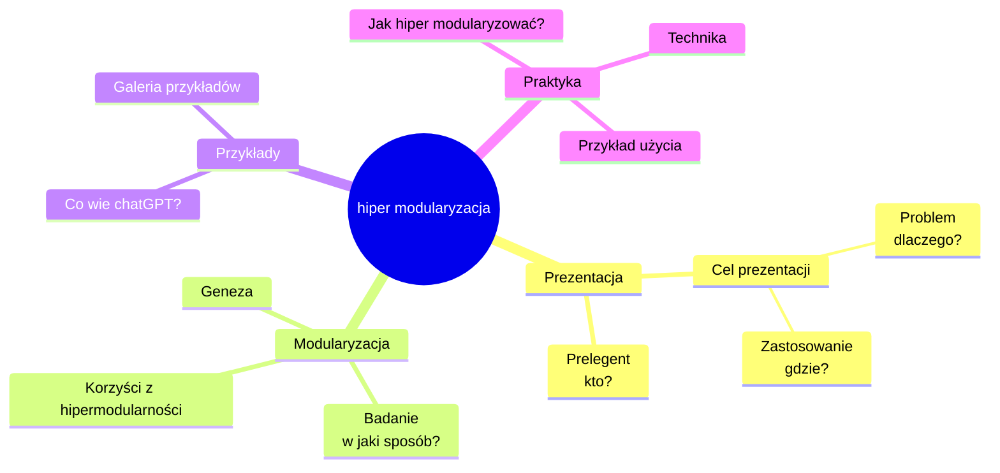
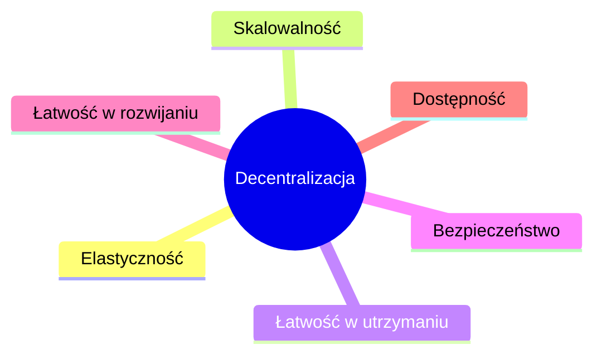

# prezentacja [prezentacja.hipermodularyzacja.pl](https://prezentacja.hipermodularyzacja.pl/)

### Informacje:

+ Temat: **Hipermodularyzacja** w praktyce hardware & software development

+ Opis: Na dzisiejszym spotkaniu omówimy, jak modułowa architektura i hipermodularność stanowią ważne koncepcje dla DevOps, twórców sprzętu i oprogramowania.
  Omówimy korzyści związane z decentralizacją, w tym elastyczność, skalowalność, łatwość w utrzymaniu, bezpieczeństwo, łatwość w rozwijaniu i lepszą dostępność systemu.
  Podyskutujemy o wpływie decentralizacji, modularyzacji i hipermodularyzacji na procesy doskonalenia sieci.

+ Keywords: Modularyzacja, hipermodularność, decentralizacja, elastyczność, skalowalność, reużywalność, konserwacja, odporność, dostosowywanie, kooperacja, zwinność, odporność, dostępność.

+ Czas: Czwartek, 11 maja 2023 17:00

+ Miejsce: Meetup, [Hipermodularyzacja w praktyce hardware & software development](https://www.meetup.com/pl-PL/devops-institute-skilup-poland/events/293100939/)

+ Prelegent: Tom Sapletta


### Plan:


#### Prezentacja
###### 1. Prelegent
###### 2. Cel prezentacji
###### 3. Problem - dlaczego?
###### 4. Zastosowanie - gdzie?

#### Hipermodularyzacja
###### 5. Geneza
###### 6. Badanie - w jaki sposób?
###### 7. Korzyści z hipermodularności

####  Przykłady
###### 8. Co wie chatGPT?
###### 9. Galeria przykładów


####  Praktyka
###### 10. Jak hiperm odularyzować?
###### 11. Metoda hiper modularyzacji
###### 12. Przykład użycia

##### Dyskusja

*Każdy punkt jest obliczony na ok. 3 minuty


### Prezentacja w formie mapy myśli





+ [Online FlowChart & Diagrams Editor](https://mermaid.live/edit#pako:eNpdUsFuwjAM_RUrJ5D4AjQNaZuEtAkJaZxQLyYxbWgaV2mqqkFcdtlH7DO47sb4r7VAy9ac7Gc_O372XkhWJKYi01ZlmEcWwDH70SjROTnIWJUGXR1Q7nA8bsMAS0eBrG-hK3CBDMUN-LBxj6nn2RXuws9kIO9ZuoNbHm8MZS1LGZSBYp7do2ssPBdcodXUpsQqaBqU7qzF3592wTlZCvif8ISqq1fBDlMNRc7F6bgZFH5jF-rzl9QQ4CLGTQvLLdhldYqEOj1_oKr7iRkqTSAT9PPlqp9pjoacxkaMG-F0rGDwhqUx9XXaj7QimVh9918xhcGuGsF-Pmf31dxaQXn-rqXGYT8xEVkzHWrV3MG-pUXCJ5RRJKaNaan0Dk0kIntoUrH0_F5bKaZbNAVNRJkr9PSiMXaY9WiOds1890lpz25xPTbJdqtjcfgFi97JiQ)


---

# 1. Prelegent

Kim jestem?

### Co robię?

+ [github](https://github.com/tom-sapletta-com)/tom-sapletta-com
    + ponad 200 projektów, kilka tysięcy repozytoriów z otwartymi źródłami

+ [linkedIn](https://www.linkedin.com/in/tom-sapletta-com/)/tom-sapletta-com
    + [makerslab](http://discord.makerslab.pl) - społeczność, kooperacja
    + [softreck](http://www.softreck.pl) - opensource: dialogware

### Role:

+ [entuzjasta](http://www.entuzjasta.pl) technologii, metodologii, socjologii, cybernetyki
+ Badacz, [researcher](http://www.researcher.pl)
+ Programista, DevOps, [platform engineer](http://www.platformengineer.pl)

### Tematy:

+ [modularyzacja](http://www.entuzjasta.pl)
+ [automatyzacja](http://www..pl)
+ [bezpieczeństwo](http://www..pl)

### Ślad węglowy:

+ do 2013 Polska
+ do 2023 Niemcy
+ ...


+ [Żródło: github/tom-sapletta-com - Tom Sapletta](https://github.com/tom-sapletta-com)


# 2. Cel prezentacji


[żródło: Film pt. Rejs, youtube](https://www.youtube.com/watch?v=ylfdoWEyYXQ)


### Temat

Temat Hipermodularyzacji jest niezależny od branży, interdyscyplinarny, mimo wszystko jest tak niszowy, że w Polsce tylko dwie osoby o tym napisały w ciągu ostatnich lat.
Wg Google w Polsce osoby, które poruszyły temat: hipermodularyzacja to Tomasz Jakut i ja.
+ Czy wobec tego pisanie książki i tworzenie prezentacji o hipermodularyzacji jest pozbawione sensu?


### Cel

Celem tej prezentacji jest przekazanie wiedzy na temat moich wieloletnich badań na temat hipermodularyzacji.
Dobrze udokumentowana wiedza, sprawdzona, powtarzalna jest lepszym podłożem do zwiększenia ilościowego całej sieci, zwielokrotnieniem jej wiązań oraz zmniejszenie kosztu utrzymania.
To oznacza, że jako ludzie stosujący modularne myślenie możemy zajmować się dziesiątkami, setkami projektów w ciągu roku i tysiącami w ciągu kilku lat.


### Korzyści

+ Posiadanie i zarządzanie tylko tym co jest nam niezbędne
+ Inwestowanie energi, czasu i środków tylko w to co jest nam niezbędne a nie w dedykowaną infrastrukturę
+ Eksperymentowanie, ciągłą edukację przez praktykę
+ Optymalizanie drogi dojścia do rezultatu, poprzez bazowanie na już wypracowanych rezultatach


### Dlaczego?

Dlaczego warto uczyć się i stosować hipermodularyzację?
Wielu z nas ceni sobie minimalizm, ale nie możemy go narzucić innym, starając się respektować to, że świat jest złożony.
Hipermodularyzacja pomaga utrzymać w porządku magazyn z tysiącami pudełek, które czy chcemy czy nie musimy umieć w odpowiednim momencie znaleźć, otworzyć i użyć.
Każda odnajdywalna i nazywalna rzecz w naszym meta świecie jest wartością, każda niepotrzebna, nienazywalna rzecz jest przeszkodą, tworzącą bałagan.

### Niezależność - wolność od ograniczeń

Bezludna wyspa:
+ Co zabierzesz ze sobą na bezludną wyspę?
  Dlaczego czegoś nie zabierzesz?
  Jakbyś mógł zabrać wszystko co możesz, gdybyś mógł wysłać posłańca, jakbyś mu przekazał, nie mogąc samemu tego przywieźć?
  Każda rzecz, której nie zabierzesz ze sobą na bezludną wyspę, bo nie będzie tam mebli, nie ułatwi Tobie życiażycie Tobie i bliskim niezależnie od lokalizacji.


### Minimalizm

Minimalizm pozwala na higienę, skupiając się na tym co jest dla nas ważne.
W świecie rzeczy potrzebne są metody aranżacji przestrzeni, do nas potrzeb z minimalnym nakładaem energii.
Hipermodularyzacja pozwala na realizację potrzeb, do których przygotowujemy się długofalowo, ułatwiając przewartościowanie, poznanie każdego elementu, dostosowanie go pod nasze potrzeby.


### Edukacja

To wiąże się z ciągłą edukacją, hipermodularyzacja to proces wymagający czasu, pracy i cierpliwości.
Jednak nauka i stosowanie tej umiejętności może przynieść wiele korzyści i poprawić jakość naszego życ

Celem badania hipermodularyzacji jest zwiększenie jakości systemów, wzmocnienie wiązań modułów i przez to ciągły wzrost struktury systemu i ekspansja.


### Zastosowanie

W stale zmieniającym się świecie przy dźwigni technologicznej trudno zajmować się wieloma aspektami rzeczywistości i zarządzać optymalnie posiadanymi zasobami oraz energią.
O dziwo w analogowym świecie (dla uproszczenia) sprzedaje się nam wizję binarną, dwubiegunową, jednak rzeczywistość oferuje więcej opcji:

W kontekście ograniczeń to minimalizm i maksymalizm.
Wypracowywanie wolnej przestrzeni można uzyskać poprzez redukcję lub poprzez zhierarchizowanie, ale wtedy na skutek nieprzemyślanej modularyzacji mogą przyjść podwyższone koszta zarządzania.

Umiejscowienie tego w kontekście naszego życia rodzinnego, zawodowego rodzi wyboru, które często są kompromisem i kwestią, którą pomaga rozstrzygnąć **hipermodularyzacja** to
ograniczyć koszty energetyczne, finansowe, czasowe **w dłuższej perspektywie**


### Dla kogo

Hipermodularyzacja jest dla tych, którzy:
+ lubią eksperymentować i doświadczać,
+ lubią uczyć się w praktyce,
+ poszukują, są głodni lepszej jakości,
+ biorą odpowiedzialność za skutki aktualnych działań,
+ szukają długofalowych konstruktywnych rozwiązań,
+ budują organicznie


### Forma prezentacji

W prezentacji będę posługiwał się przykładami z różnych dziedziń, gdyż modularyzacja jest interdyscyplinarna.

Dla uproszczenia przekazu posługuję się przykładami, z życia wielu z nas, abyśmy mogli na koniec w dyskusji rozmawiać na temat łatwych do wyjaśnienia przykładów.


### Jak powstała ta prezentacja?

Ta prezentacja jest podsumowaniem wieloletnich prac badawaczych nad drogą dotarcia do automatyzacji.
Badałem specyfikę i naturę metod, które sprawdzają się w różnych branżach i zastosowaniach.

Wiele  z tych doświadczeń była o wiele trudniejsza i kosztowniejsza 20 lat temu, gdy dopiero starałem się adaptować świat do swoich potrzeb i możliwości.
Dziś jest to możliwe znacznie szybciej.


### Jakie książki polecam?

+ [Systems and Software Quality: The next step for industrialisation,  von Martin Wieczorek, Diederik Vos, Heinz Bons](https://www.amazon.de/Systems-Software-Quality-next-industrialisation/dp/3662514044)
+ [hipermodularyzacja -  w trakcie pisania](http://hipermodularyzacja.pl)


### Nagroda

Nagrodą będzie ebook, dla każdego uczestnika, książki, która bedzie dostępna za 6 miesięcy w Listopadzie 2023.
+ prosze o kontakt na linkedin


# 3. Problem - dlaczego?

### Bałagan


### Forma i treść


[żródło: Film pt. Rejs, youtube](https://www.youtube.com/watch?v=ylfdoWEyYXQ)


# 4. Zastosowanie - gdzie?


+ Rozwój oprogramowania
+ Architektura
+ Infrastruktura
+ Projektowanie produktów
+ Zarządzanie projektami
+ Magazynowanie


+ [Źródło: SDU Robotics](https://www.sdu.dk/en/forskning/sdurobotics)


+ źródło: [Jak zaprowadzić porządek w pokoju dziecka? » Brykacze.pl - blog. Wszystko o zabawkach.](http://blog.brykacze.pl/zaprowadzic-porzadek-pokoju-dziecka/rodzic/)


# 5. Geneza

+ Tło
+ Cel Hipermodularyzacji
+ Różnice między Modularyzacją i Hipermodularyzacją
+ Architektura modułowa


Wprowadzenie do hipermodularyzacji

+ Muzyka, [www/tekst.md](https://github.com/hipermodularyzacja/www/blob/main/tekst.md)

## Podsumowanie
1. Modularyzacja polega na tworzeniu sieci modułów, natomiast hipermodularyzacja polega na rozbijaniu istniejących modułów na mniejsze i bardziej wyspecjalizowane moduły.
2. Modularyzacja skupia się na zarządzaniu architekturą, natomiast hipermodularyzacja skupia się na samych modułach.
3. Modularyzacja ma na celu ułatwienie tworzenia lepszych systemów, przez tworzenie ustandaryzowanych i wyspecjalizowanych modułów.
4. Problemy związane z modularyzacją to głównie brak granic, które można odwzorować na klocki, czyli trudność w dopasowaniu rzeczywistości do wzorca.
5. Modularyzacja ma na celu zmienianie rzeczywistości poprzez zawężenie pola oddziaływania modularyzacji, tworzenie nowych modułów i wymianę tych istniejących.


## Tło

Automatyzacja wymusza modularyzację, standaryzację i specjalizację.

Droga do automatyzacji zaczyna się od modularyzacji, ponieważ, zanim będziemy wiedzieli jaki standard użyć, możemy wcześniej na podstawie minimalnych danych o cechach procesu poznać jaka jest jego specyfika i przez to przyporzadkować go do określonego zbioru.


### Cel Hipermodularyzacji

+ **Hipermodularyzacja** przenosi architekturę modułową na wyższy poziom.
+ Wykracza poza tradycyjne podejście modułowe i obejmuje podział systemu na mniejsze, bardziej wyspecjalizowane moduły.
+ **Hipermodularyzacja** zajmuje się nie tyle zarządzaniem architekturą, co skupieniem się na najmniejszych elementach, by projektować moduły, które będą ułatwiały tworzenie lepszych systemów.


### Różnice między Modularyzacją i Hipermodularyzacją


##### W prostych słowach:

+ **Modularyzacja** to budowanie systemu poprzez wykorzystanie gotowych modułów.
+ **Hipermodularyzacja** to rozbijanie istniejących modułów na mniejsze, by stworzyć więcej prostych, re-używalnych modułów.


##### Modularyzacja w budowaniu systemów

**Modularyzacja** zajmuje się tworzeniem sieci modułów, **Hiermodularyzacja** wchodzi istotę samych modułów, determinuje ich powstawanie, narzuca standardy.

Modularyzacja to tworzenie sieci modułów. (Ilościowe)

**Hipermodularyzacja** to tworzenie ustandaryzowanych i wyspecjalizowanych modułów. (Jakościowe)


### Architektura modułowa


### Problemy związane z modularyzacją, jak rozeznać granice?
+ [156. Wrocław JUG - Problemy wynikające z modularyzacji. - Łukasz Szydło - YouTube](https://www.youtube.com/watch?v=JJXmgCx_wh0)


# 6. Badanie - w jaki sposób?


+ Problem
+ Rozwiązanie
+ Hipoteza
+ Procedura
+ Proces
+ Technika
+ Dyrektywa
+ Metoda
+ Metodyka
+ Metodologia


[Badanie](badanie.md)


# 7. Korzyści z hipermodularności

## Podsumowanie

Modularyzacja to droga do solidnych, elastycznych i wydajnych systemów.
Modułowa architektura i hipermodularność to ważne koncepcje dla DevOps, twórców sprzętu i oprogramowania, które oferują wiele korzyści w zakresie elastyczności, skalowalności, reużywalności, konserwacji, odporności, dostosowywania i współpracy. Decentralizacja może przynieść wiele korzyści, w tym elastyczność, skalowalność, łatwość w utrzymaniu, bezpieczeństwo, łatwość w rozwijaniu i lepszą dostępność systemu.


### Korzyści:

Korzyści systemu opartego o hipermodularne elementy łączy te wszystkie korzyści jednocześnie:

+ Zwinność, Agility
+ Odporność, Resilience
+ Dostosowalność, Customization
+ Kooperacja
+ Elastyczność, Flexibility
+ Skalowalność, Scalability
+ Reużywalność, Reusability
+ Konserwacja
+ Decentralizacja


## Decentralizacja a Modularyzacja

+ Czy decentralizacja jest zawsze modularna?
+ Co jeśli decentrazliacja nie jest przeprowadzona w modularny sposób?
+ Jak przebiega doskonalenie sieci zdecentralizowanej?
  Decentralizacja w kontekście modularyzacji przynosi wiele korzyści, w tym większą elastyczność, skalowalność, łatwość w utrzymaniu, bezpieczeństwo, łatwość w rozwijaniu i lepszą dostępność systemu.

+ Elastyczność
+ Skalowalność
+ Łatwość w utrzymaniu
+ Bezpieczeństwo
+ Łatwość w rozwijaniu
+ Dostępność




Decentralizacja może przynieść wiele korzyści w kontekście modularyzacji, w tym:

### Elastyczność:
Decentralizacja umożliwia łatwe dodawanie lub usuwanie modułów bez wpływu na cały system. Każdy moduł może działać niezależnie, co daje większą elastyczność w zarządzaniu projektem.


### Skalowalność:
Modułowa architektura ułatwia skalowanie systemu. Dzięki temu możemy łatwo rozbudować system o dodatkowe moduły, gdy jest to potrzebne.


### Łatwość w utrzymaniu:
W przypadku awarii lub problemów z jednym modułem, łatwo można go wyłączyć i naprawić. Nie ma potrzeby zatrzymywania całego systemu.


### Bezpieczeństwo:
Decentralizacja może zwiększyć bezpieczeństwo systemu, ponieważ każdy moduł jest odpowiedzialny tylko za swoją własną funkcjonalność. W przypadku ataku lub naruszenia bezpieczeństwa jednego modułu, reszta systemu będzie nadal działać.


### Łatwość w rozwijaniu:
Decentralizacja ułatwia rozwijanie systemu poprzez dodawanie nowych modułów. Każdy moduł może być rozwijany przez różnych programistów, co przyspiesza proces rozwoju.


### Dostępność:
Decentralizacja umożliwia lepszą dostępność systemu. Jeśli jeden moduł przestanie działać, pozostałe moduły będą nadal dostępne dla użytkowników.


# 8. Co wie chatGPT?

Zadawanie właściwych pytań

Właściwe zadawanie pytań jest konieczne do poznania prawdy na temat, który nas interesuje,
zwłaszcza w kontekście ostatniego roku dostępności sztucznej inteligencji do masowego użycia.
Część tej prezentacji (teoretyczna) powstała w ostatnim tygodniu, przy pomocy chatGPT 3.5, właśnie dzięki zadawaniu odpowiednich pytań


+ Modularity and hypermodularity in the daily routine of a person working with people
+ Modularity and hypermodularity in preparing a presentation
+ Examples of usage between modularity and hypermodularity
+ How to learn the Modular thinking approach?
+ How to learn the hypermodular thinking approach?
+ How to live in hyper modular world, how to manage the all modular elements?


## Modularity and hypermodularity in the daily routine of a person working with people

#### Modularity:

+ A personal trainer who uses modular programming to create tailored workout plans for each client, based on their individual fitness goals and abilities.

+ A teacher who uses modular lesson plans to create customized learning experiences for each student, based on their individual learning style and level of understanding.

+ A therapist who uses modular therapy techniques to create personalized treatment plans for each client, based on their individual needs and goals.

#### Hypermodularity:

+ A life coach who uses hypermodularity to break down the coaching process into smaller, specialized components such as goal setting, time management, and personal development, allowing for greater flexibility and customization.

+ A social worker who uses hypermodularity to break down the case management process into smaller, specialized components such as housing, education, and healthcare, allowing for greater collaboration and coordination with other service providers.

+ A mentor who uses hypermodularity to break down the mentoring process into smaller, specialized components such as career development, skill building, and personal growth, allowing for greater customization and scalability.


## Modularity and hypermodularity in preparing a presentation

#### Modularity:

+ A presenter who uses modular slide templates to create a consistent visual style throughout the presentation, including headers, bullet points, and images.

+ A presenter who uses modular content modules to create a presentation with customized information for each audience, including data, graphics, and case studies.

+ A presenter who uses modular presentation software to create a presentation that can be easily customized and reused for multiple presentations, including themes, layouts, and transitions.

#### Hypermodularity:

+ A presenter who uses hypermodularity to break down the presentation into smaller, specialized components such as introduction, main points, and conclusion, allowing for greater flexibility in adjusting the order or adding/removing components.

+ A presenter who uses hypermodularity to break down the presentation into smaller, specialized content modules such as videos, animations, and interactive elements, allowing for greater customization and engagement.

+ A presenter who uses hypermodularity to break down the presentation into smaller, specialized versions for different audiences, allowing for greater customization of the content and delivery style based on the audience's needs and preferences.


## How to learn the Modular thinking approach?

Modular thinking is a way of approaching problems by breaking them down into smaller, more manageable pieces. Here are some steps you can take to learn modular thinking:

#### Start with small problems:
Begin by breaking down small problems into smaller, more manageable pieces. This will help you develop your modular thinking skills and build confidence.

#### Identify the components:
Once you have identified the problem, start identifying the different components or modules that make up the problem. Try to understand how these components work together to create the problem.

#### Define the interfaces:
Next, define the interfaces between the different components. This will help you understand how the different modules interact with each other.

#### Develop a modular design:
Once you have identified the components and interfaces, start developing a modular design. This should include how the different modules will work together to solve the problem.

#### Test and iterate:
Test your modular design to see if it solves the problem. If it does not, iterate and refine your design until you find a solution that works.

#### Practice, practice, practice:
Keep practicing modular thinking by breaking down larger problems into smaller, more manageable pieces. This will help you build your skills and become more comfortable with the approach.

#### Learn from others:
Seek out resources, books, and mentors who can help you learn more about modular thinking. You can also learn from others by studying their designs and solutions.

By following these steps, you can develop your modular thinking skills and become better equipped to tackle complex problems in a more efficient and effective way.


#### How to learn the hypermodular thinking approach?

Hypermodular thinking is an advanced approach to problem-solving that involves breaking down complex systems or problems into smaller, highly specialized components or microservices. Here are some steps you can take to learn hypermodular thinking approach:

#### Understand modularity:
Before you can understand hypermodularity, it's important to understand modularity. Learn about modular design principles, practices, and tools.

#### Study hypermodular systems:
Study and analyze existing hypermodular systems, such as microservices architecture or modular product design. This will help you understand how different modules can work together to create a more flexible and scalable system.

#### Learn to break down problems:
Develop your ability to break down complex problems into smaller, more specialized components. This requires a deep understanding of the problem and the ability to identify the different components of the problem.

#### Focus on interfaces:
In hypermodularity, interfaces between different components are critical. Learn how to design effective interfaces that allow modules to work together seamlessly.

#### Develop a modular mindset:
Hypermodular thinking requires a mindset that is focused on breaking down problems into smaller pieces. Practice this mindset by breaking down problems in your daily life, such as organizing your workday or planning a trip.

#### Experiment with hypermodularity:
Start experimenting with hypermodular design in your own work. Start with small projects and build your way up. This will help you gain experience and build your skills.

#### Learn from others:
Seek out resources, books, and mentors who can help you learn more about hypermodular thinking. You can also learn from others by studying their designs and solutions.

By following these steps, you can develop your hypermodular thinking skills and become better equipped to tackle complex problems in a more flexible and scalable way. Remember to start small, focus on interfaces, and keep experimenting to build your skills.


# 9. Galeria przykładów

Galeria Przykładów **hipermodularyzacji**

+ Oprogramowanie, Software
+ Sprzęt, Hardware
+ Przeprowadzka
+ Magazynowanie


#### Oprogramowanie:

Moje projekty:
+ Dialogware: text2software - zmodularyzowane budowanie aplikacji
+ Metamoduły bazujące na tym:  [docs.metamodule.org](https://docs.metamodule.org/)


### architektura modularna i monolityczna

+ [Modularyzacja: kolejny modny trend IT, czy jedyna słuszna droga? - Tech Blog ING Bank Śląski](https://techblog.ing.pl/blog/modularyzacja-kolejny-modny-trend-it-czy-jedyna-sluszna-droga)


systemy do pakowania przedmiotów
systemy układania


### Przeprowadzka:

+ oddziaływanie forma <-> treść


### Magazynowanie

Modularne, mobilne skrzynki z materiałami do pracy

+ Regał ivar z firmy ikea
+ Systemowe skrzynki macpac firmy makita
  

+ możliwość szybiego i łatwego transportu oraz korzystania z zawartości w terenie
  

+ łatwe odnajdywanie potrzebnego elementu
  


### Modularny hardware

[Mobilna serwerownia – militarity](https://militarity.com/index.php/2023/04/18/mobilna-serwerownia/)

##### Dlaczego?

+ tylko potrzebne elementy systemu
  

+ łatwe dopasowanie do instejącego stanowiska
  


##### Jedna warstwa zawiera:


# 10. Jak (hiper)modularyzować?


## Metodyka w IT

#### Rozwijaj modułowy sposób myślenia

#### Zapoznaj się z interfejsami

#### Korzystaj z narzędzi modułowych

#### Ćwicz projektowanie modułowe

#### Współpracuj z innymi

#### Nieustannie się ucz

#### Różnicowanie

#### Przechodzenie pomiędzy poziomami


# 11. Metoda hipermodularyzacji


```
Sieć
 Ogranicz
 Ulepsz
 Powiel

Gałąź
 Identyfikuj
 Dziel
 Łącz
  
Moduł
 Projektuj
 Buduj
 Testuj
 Integruj
```


## Podsumowanie


### Sieć


+ Ograniczaj --> Ulepszaj --> Powielaj


### Galąź (Node, Proces)


+ Identyfikuj --> Dziel --> Łącz


### Moduł (Hipermodularyzacja)

+ Projektuj --> Buduj --> Testuj --> Integruj


# 12. Przykład użycia


### Programowanie
Sieć: infrastruktura, Architektura, DevOps
Gałąź: biblioteka, aplikacja
Moduł: klasa, program, funkcja
Dane: formaty danych json, html, txt


### Pokój dziecka:


#### Etap 1

[Jak utrzymać porządek w pokoju dziecka? - Mamy Gadżety](https://mamygadzety.pl/porzadek-pokoju-dziecka/)


#### Etap 2


+ źródło: [Jak zaprowadzić porządek w pokoju dziecka? » Brykacze.pl - blog. Wszystko o zabawkach.](http://blog.brykacze.pl/zaprowadzic-porzadek-pokoju-dziecka/rodzic/)


#### Etap 3


Proza codzienności:


Transparentne pojemniki:


Wnioski:
+ Zmniejszenie barier, ciężaru, dopasowanie do wzrostu i możliwości operatora
+ Wyłączenie szuflad, dużych kartonów i szafek
+ otwarte, transparentne przestrzenie ułatwiają dotarcie i odłożnie przedmiotu


----


### koniec:
klask, klask, klask


# Dyskusja [15 Minut]

Co na to jury?


+ pytania
+ rozwiązania
+ doświadczenia

